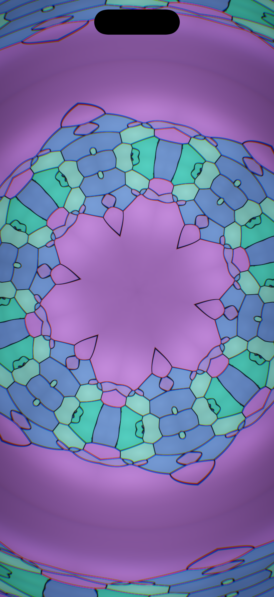
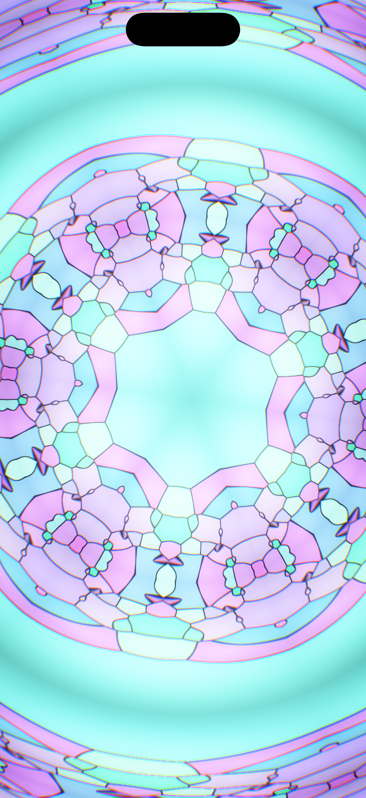
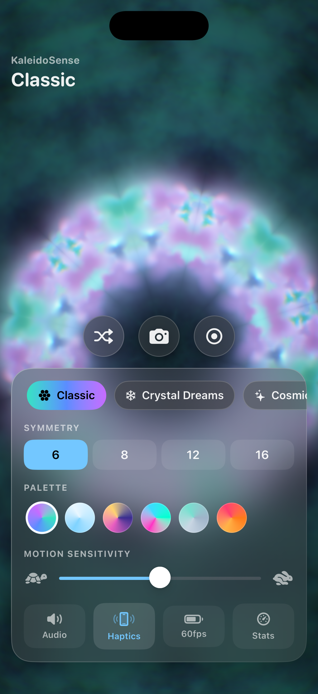
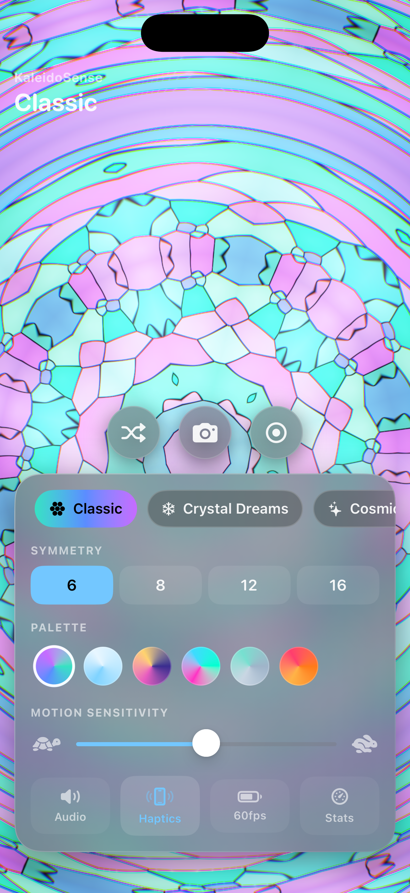
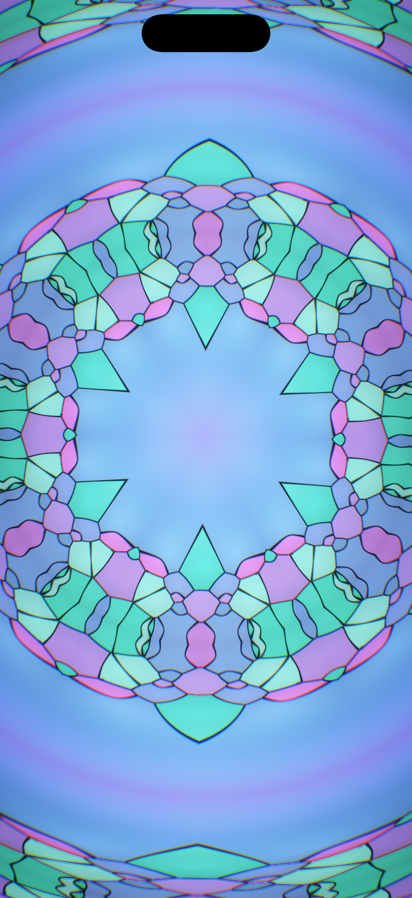
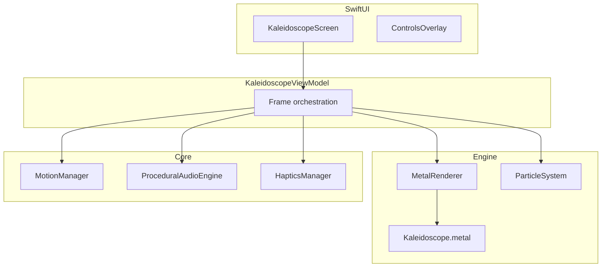

# KaleidoSense

An immersive, GPU-rendered kaleidoscope for iPhone. Tilt, rotate, and shake your device to tumble glass fragments inside a virtual chamber — the pattern, procedural audio, and haptics all respond to real motion in real time at up to **120 FPS**.

Built with **Swift 6**, **SwiftUI**, **Metal**, **CoreMotion**, **AVAudioEngine**, and **CoreHaptics**.  
**iOS 18+** · iPhone only · No third-party dependencies.

<p align="center">
  
</p>

---

## Screenshots

### Full-screen kaleidoscope
GPU-rendered dihedral symmetry with crisp stained-glass shards that fill the entire screen.

<p align="center">
  
</p>

### Glass control surface
visionOS-inspired glassmorphism UI with mode, symmetry, palette, and motion controls. Auto-hides for an immersive view.

<p align="center">
  
  &nbsp;&nbsp;
  
</p>

### Dynamic lighting
Orbiting lights, iridescent tints, and specular glints that enhance shard colors as you move the phone.

<p align="center">
  
</p>

---

## Features

| Feature | Description |
| --- | --- |
| **Motion-driven physics** | Shards move only when you move the phone; they settle instantly when you hold it still — like a real kaleidoscope. |
| **Six visual modes** | Classic, Crystal Dreams, Cosmic Galaxy, Neon Prism, Liquid Glass, Mandala — each with unique palettes, physics, and effects. |
| **Runtime symmetry** | Switch between 6, 8, 12, and 16 segment mirror symmetry live. |
| **Procedural audio** | Bell chimes, crystal clicks, and a rolling noise bed — synthesized from motion, no audio loops. |
| **CoreHaptics** | Subtle ticks, swells, and taps for a premium tactile feel. |
| **Capture & share** | High-resolution stills and H.264 video recording, saved to Photos with share sheet. |
| **120 FPS** | ProMotion-ready rendering with optional 60 FPS battery-saver mode. |
| **Accessibility** | VoiceOver labels, Reduce Motion, and Reduce Transparency support. |

### Interactions

- **Single tap** — toggle controls  
- **Double tap** — randomize pattern  
- **Tilt / rotate / shake** — tumble the glass fragments  
- **Shuffle · Camera · Record** — randomize, capture photo, record video  

---

## Requirements

- Xcode 16+ (Swift 6)
- iOS 18+ physical iPhone (recommended for motion, haptics, and ProMotion)
- Apple Developer account for device deployment (set your own signing team in Xcode)

---

## Getting started

```bash
git clone https://github.com/YogeshBhusara/KaleidoSense.git
cd KaleidoSense
open Kaleidoscope.xcodeproj
```

1. Select your **Development Team** under *Target → Signing & Capabilities*.
2. Change the **Bundle Identifier** if needed (default: `com.kaleidosense.app`).
3. Choose an iPhone simulator or a connected device and **Run** (⌘R).

If Metal shaders fail to compile on first open with Xcode 26:

```bash
xcodebuild -downloadComponent MetalToolchain
```

Grant **Motion & Fitness** when prompted for tilt control, and **Photos** access when saving captures.

---

## Architecture

MVVM with a single `KaleidoscopeViewModel` orchestrating the engine, core services, and UI.



### Frame loop

1. `MTKView` calls `MetalRenderer.draw(in:)` at up to 120 Hz.
2. View model samples CoreMotion, advances particle physics, updates audio/haptics.
3. Particle positions are folded into the symmetry wedge on the CPU.
4. A single full-screen Metal pass renders dihedral symmetry, Voronoi glass shards, dynamic lighting, bloom, and tone mapping.
5. Triple-buffered uniform/particle buffers avoid CPU/GPU stalls.

### Project structure

```
Kaleidoscope/
├── KaleidoscopeApp.swift
├── Core/           Motion, Audio, Haptics, Performance, Extensions
├── Engine/         Models, Physics, Metal renderer, Shaders
├── Features/       Kaleidoscope screen/VM, Controls, Export
├── UI/             Theme, GlassCard, ShareSheet
└── Assets.xcassets
docs/
└── screenshots/    App feature screenshots for this README
```

---

## Performance

- Single full-screen GPU pass — no intermediate render targets.
- CPU-side symmetry folding keeps the per-pixel particle loop cheap.
- Cap at `KS_MAX_PARTICLES = 64` for consistent 60–120 FPS.
- Enable **Stats** in-app for live FPS / frame-time HUD.

Profile with **Metal System Trace**, **Time Profiler**, and **Energy Log** in Instruments.

---

## Privacy

The app uses on-device sensors only:

| Permission | Purpose |
| --- | --- |
| Motion & Fitness | Tilt, rotation, and shake to drive the kaleidoscope |
| Photo Library (add) | Save captured images and videos |

No analytics, no network calls, no third-party SDKs.

---

## License

MIT License — see [LICENSE](LICENSE).

---

## Contributing

Issues and pull requests are welcome. Please open an issue before large changes.

---

## Future enhancements

- Spatial audio via `AVAudioEnvironmentNode`
- Separable bloom pass for richer glow
- iPad and visionOS targets
- User presets and pattern bookmarks
